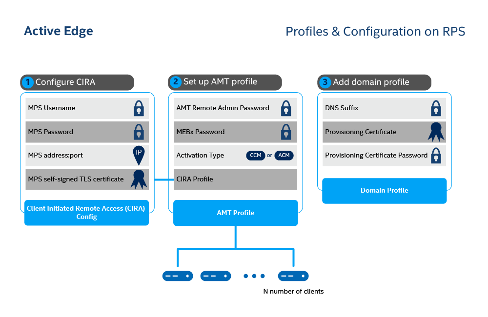

Intel AMT&reg; devices are capable of being activated into two modes:

- [**Admin Control Mode (ACM):**](../Glossary.md#a) In this mode, there are no limitations to Intel AMT functionality. This reflects the higher level of trust associated with these setup methods. No user consent is required.

- [**Client Control Mode (CCM):**](../Glossary.md#c) This mode limits some of Intel AMT functionality, reflecting the lower level of trust.

    Features requiring User Consent:

    - Keyboard, Video, Mouse (KVM) Control
    - IDE-Redirection for sharing and mounting images remotely



**Figure 1: Set up configuration and profiles for N number of clients. **

### What You'll Need

#### Provisioning Certificate

By purchasing a certificate, you'll be able to remotely activate an Intel AMT device in ACM. This feature enables you to disable User Consent. Provisioning Certificates are available from four different Certificate Authorities:

- [Comodo](https://www.intel.com/content/www/us/en/architecture-and-technology/intel-active-management-technology/how-to-install-comodo-certificates.html)
- [DigiCert](https://www.intel.com/content/www/us/en/support/articles/000055009/technologies.html)
- [Entrust](https://www.intel.com/content/www/us/en/support/articles/000055010/technologies/intel-active-management-technology-intel-amt.html)
- [GoDaddy](https://www.intel.com/content/dam/support/us/en/documents/software/software-applications/how_to_purchase_and_install_godaddy_certificates_for_setup_and_configuration.pdf)

#### DNS Suffix
The [DNS suffix](../Glossary.md#d) encompasses the [domain suffix](../Glossary.md#d) (e.g., .com) and follows the hostname. Consider the following DNS Name example:

???+ Example
    DNS Name: cb-vending1.burgerbusiness.com

In this example, the hostname is **cb-vending1** and the DNS suffix is **burgerbusiness.com.**

 **To set the DNS suffix: **

1. Manually modify it MEBX on the managed device. Find instructions [here](../Topics/mebx.md)
2. Alternately, change the DHCP Option 15 to DNS Suffix within the Router settings.

**To find the the DNS suffix, use the following command: **

=== "Windows"
    ```
    ipconfig /all
    ```
=== "Linux"
    ``` bash
    ifconfig
    ```

<br>


### Create a Profile

[Profiles](../Glossary.md#p) provide configuration information to the AMT Firmware during the activation process with the Remote Provisioning Client (RPC).

!!! note "Production Environment"
        In a production environment, devices are typically activated in ACM mode. ACM mode enables KVM access to devices without user consent. In most IoT use cases, edge devices such as digital signage or kiosks may not have immediate access to it or employees nearby. ACM mode proves immensely helpful in these scenarios.


**To create an ACM profile:**

1. Select the **Profiles** tab from the menu on the left.

2. Under the **Profiles** tab, click **New** in the top-right corner to create a profile.

3. Specify a **Profile Name** of your choice.

4. Uncheck **Generate Random Password.**

    !!! tip "Production Environment"
        In a production environment, you typically generate a random password for each AMT device to create a stronger, more secure AMT environment.

5. Provide a strong AMT Password. 
    
    !!! important
        This password must meet standard, **strong** password requirements:

        - 8 to 32 characters

        - One uppercase, one lowercase, one numerical digit, one special character

6. Select the name of the **CIRA Configuration** you created previously from the drop-down menu.

7. Under Activation, select **Admin Control Mode** from the dropdown menu.

8. Click **Create.**


[](../assets/images/RPS_CreateProfile_ACM.png)

**Figure 2: Create an ACM AMT profile. **

### Create a Domain Profile

In addition to a CIRA Config and an ACM AMT Profile, ACM requires the creation of a Domain profile.

Intel AMT checks the network DNS suffix against the provisioning certificate as a security check. During provisioning, the trusted certificate chain is injected into the AMT firmware.  AMT verifies that the certificate chain is complete and is signed by a trusted certificate authority.

**To create a domain:**

1. Select the **Domains** tab from the left-hand menu.

2. In the top-right corner, click **New.**

    [](../assets/images/RPS_NewDomain.png)

    **Figure 3: Create Domain. **

3. Specify a Domain **Name** of your choice.

4. Provide your ** Domain Suffix**. This is the actual DNS Suffix of the network domain that is set in DHCP Option 15 or manually on the AMT device through MEBX.

5. Click **Browse ** and select your purchased Provisioning Certificate.  This certificate must contain the private key.

6. Provide the Password of the Provisioning Certificate used to encrypt the `.pfx` file.

7. Click **Create.**

    !!! example
        Example Domain:
            
        [](../assets/images/RPS_CreateDomain.png)
        **Figure 4: Add Provisioning Certificate. **

        After successfully creating the domain, continue with the activation process by building and running the Remote Provisioning Client (RPC).


## Next Up

[Build RPC on a Managed Device](../General/buildRPC.md)


